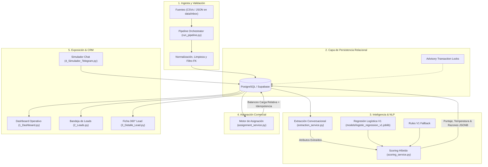
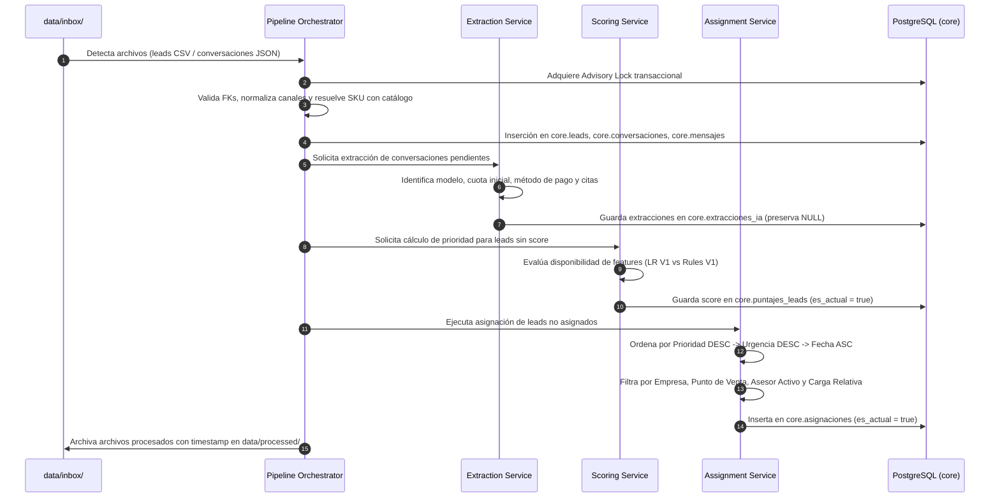
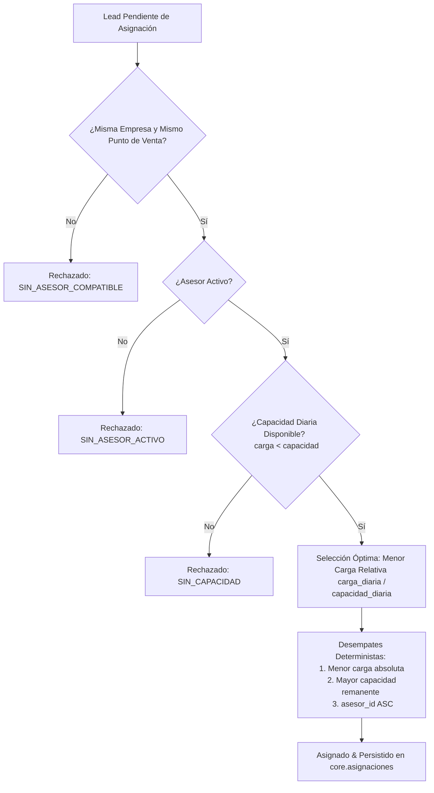
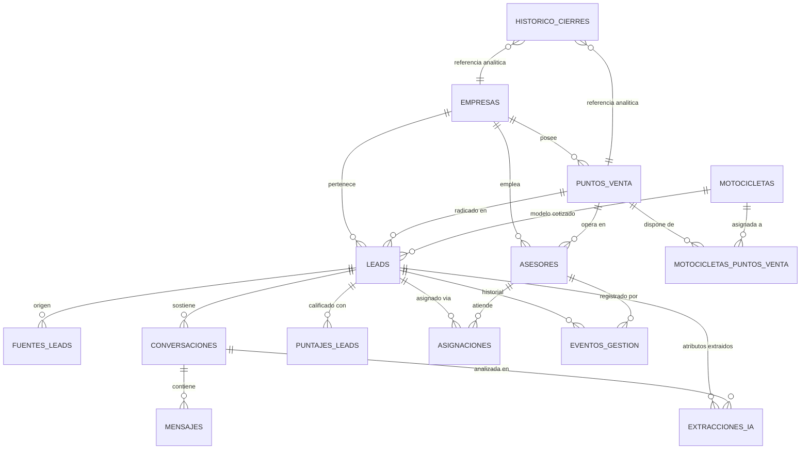

# motos-AI

> Sistema inteligente de ingesta, extracción (ctualmente es extracción determinista basada en reglas/patrones), scoring híbrido y asignación automática multiempresa de leads comerciales para el sector de motocicletas.

[](https://www.python.org/)
[](https://www.postgresql.org/)
[](https://streamlit.io/)
[](LICENSE)

---

## 1. Problema de Negocio

En la comercialización de motocicletas en redes de concesionarios y canales digitales, los equipos comerciales enfrentan una ineficiencia operativa recurrente:

> **“Los asesores llaman al lead que llegó primero, no al que mayor probabilidad tiene de comprar.”**

Este enfoque tradicional FIFO (*First-In, First-Out*) genera problemas críticos:

1. **Degradación de urgencia (*lead decay*):** Compradores con alta intención, disponibilidad de cuota inicial o solicitud expresa de cita pierden interés al no ser atendidos en su ventana óptima (<1 hora).
2. **Capacidad comercial malgastada:** Asesores dedican tiempo valioso a prospectos exploratorios o de baja cualificación, saturando la capacidad diaria de los puntos de venta.
3. **Falta de visibilidad y balanceo:** Distribución manual o desbalanceada de prospectos entre asesores, sin considerar la carga relativa diaria ni el aislamiento corporativo entre empresas y puntos de venta.

---

## 2. Solución Propuesta

**motos-AI** transforma la bandeja de entrada comercial mediante un pipeline automatizado, explicable y desacoplado que:

1. **Ingiere y normaliza** datos de leads y conversaciones provenientes de fuentes estructuradas (CSV/JSON), con un diseño preparado para incorporar conectores multicanal.
2. **Extrae atributos comerciales** no estructurados desde conversaciones mediante reglas NLP deterministas con preservación estricta de valores ausentes (`NULL`).
3. **Calcula un scoring de prioridad híbrido (0–100)** basado en un modelo principal de **Regresión Logística** entrenado sobre datos históricos y un modelo **Rules Fallback** determinista para prospectos sin historial conversacional.
4. **Asigna automáticamente los prospectos** a los asesores comerciales garantizando aislamiento multiempresa, compatibilidad de punto de venta y balanceo por menor carga relativa.
5. **Persiste de forma transaccional e idempotente** cada evento y estado en PostgreSQL.
6. **Expone una interfaz de gestión CRM** construida en Streamlit con tablero analítico, bandeja priorizada, ficha de 360° del cliente y un simulador conversacional guiado.

```text
Fuentes de Leads / Chats 
  ──> Ingesta & Normalización 
  ──> Extracción NLP (Preservación NULL) 
  ──> Scoring Híbrido Explicable 
  ──> Priorización (Crítico/Alto/Medio/Bajo) 
  ──> Asignación Balanceada Multiempresa 
  ──> PostgreSQL / CRM Streamlit
```

---

## 3. Arquitectura del Sistema

El sistema implementa una arquitectura modular de servicios desacoplados en capas:



---

## 4. Flujo de Procesamiento End-to-End

El ciclo de vida de un lead en el sistema sigue 5 etapas secuenciales:



---

## 5. Funcionalidades Implementadas

* **Bandeja de Gestión de Leads:** Visualización paginada con filtros por empresa, punto de venta, temperatura comercial, estado operativo y asesor asignado.
* **Extracción de Información No Estructurada:** Procesamiento de conversaciones para capturar SKU de motocicleta, cuota inicial, forma de pago declarada (crédito vs. contado), solicitud de cotización y solicitud de citas.
* **Scoring Híbrido Explicable:** Calificación continua de 0 a 100 con desglose auditable de motivos en formato JSONB.
* **Asignación Automática Balanceada:** Algoritmo de asignación con aislamiento corporativo multiempresa y optimización por menor carga relativa.
* **Tablero de Control Operacional:** Métricas clave actualizados directamente desde PostgreSQL (KPIs de volumen, tiempos, distribución de temperaturas y avance de gestión).
* **Ficha CRM Detallada:** Vista integral del cliente con especificaciones del modelo cotizado, historial de mensajes y bitácora de eventos.
* **Simulador Conversacional Guiado:** Interfaz interactiva para reproducir flujos de mensajería con máquina de estados finitos (FSM) y persistencia en vivo.
* **Orquestador de Pipeline:** Ejecución unificada por consola con soporte para modo simulación (`--dry-run`) y reporte estructurado en Markdown.

---

## 6. Scoring y Priorización

El motor de calificación asigna a cada prospecto un **puntaje de prioridad entre 0.0 y 100.0**, agrupado en cuatro temperaturas comerciales:

| Rango de Puntaje | Temperatura | Significado Operativo |
| :--- | :--- | :--- |
| **75.0 – 100.0** | **Crítico** | Prospecto de alta conversión inmediata (<1h, cita o cuota inicial). Atención prioritaria. |
| **50.0 – 74.99** | **Alto** | Prospecto cualificado con intención firme o ventana de contacto reciente. |
| **25.0 – 49.99** | **Medio** | Prospecto en etapa de evaluación o con degradación temporal moderada. |
| **0.0 – 24.99** | **Bajo** | Espera prolongada (>48h), sin intención de financiamiento ni agendamiento. |

### Arquitectura Híbrida de Decisión

El sistema decide dinámicamente qué modelo aplicar según la presencia de señales conversacionales:

```text
               ¿Existen extracciones conversacionales?
               (solicita_cita, pago_inicial o metodo_pago)
                               │
                      ┌────────┴────────┐
                     SÍ                 NO
                      │                 │
                      ▼                 ▼
          Regresión Logística V1    Rules V1 Fallback
```

#### 1. Modelo Principal: Regresión Logística V1
* **Entrenamiento:** Entrenado sobre 2.200 registros históricos independientes (`core.historico_cierres`, casos `HX-00001` a `HX-02200`).
* **Desempeño:** ROC-AUC de 0.611–0.629, PR-AUC de 0.138–0.152, con un **Lift@10% de 1.56x** (la tasa de estimada en el 10% superior sube de 9.75% a 15.3%–16.4%). Métricas obtenidas sobre el esquema de validación utilizado durante el entrenamiento de V1; no deben interpretarse como desempeño garantizado en producción.
* **Variables y Coeficientes:**
  * $\text{log\_horas} = \ln(1 + \text{horas\_espera})$: Coeficiente **`-0.2550`** (modela el decaimiento continuo sin rupturas discretas).
  * $\text{pidio\_cita}$: Coeficiente **`+0.3068`**
  * $\text{manifesto\_cuota\_inicial}$: Coeficiente **`+0.4263`**
  * $\text{pago\_credito}$: Coeficiente **`-0.3749`**
  * $\text{Intercepto}$: **`+0.4981`**
* **Fórmula:**
  $$z = \text{intercept} + \sum \beta_i X_i$$
  $$p = \frac{1}{1 + e^{-z}}$$
  $$\text{puntaje\_prioridad} = \min(100.0, \max(0.0, \text{round}(p \times 100, 2)))$$

#### 2. Modelo Fallback: Rules V1
Se activa de forma determinista ante la ausencia de variables conversacionales:

$$\text{Puntaje} = \min\Big(100, \max\big(0, (\text{Puntaje Tiempo} \times 0.70) + (\text{Aporte Cita} \times 0.15) + (\text{Aporte Cuota} \times 0.15)\big)\Big)$$

* **Escala de tiempo base:** `< 1h` $\to$ 100 pts | `1–4h` $\to$ 80 pts | `4–12h` $\to$ 60 pts | `12–24h` $\to$ 50 pts | `24–48h` $\to$ 30 pts | `> 48h` $\to$ 10 pts.
* **Aporte por cita o cuota inicial:** 15 pts adicionales por cada señal presente.

### Explicabilidad Transparente (JSONB)
Cada score almacena en `core.puntajes_leads.razones` un objeto estructurado:

```json
{
  "modelo": "logistic_regression",
  "version": "v1.0",
  "tiempo": {
    "horas": 0.45,
    "log_horas": 0.3716,
    "z_score": 1.2541
  },
  "pidio_cita": "SI",
  "manifesto_cuota_inicial": "SI",
  "forma_pago_declarada": "contado",
  "factores_clave": [
    "Atención prioritaria (<1h sin contacto)",
    "Solicitud de cita detectada en conversación",
    "Manifestó cuota inicial",
    "Intención de pago de contado"
  ],
  "probabilidad_raw": 0.778,
  "puntaje_prioridad": 77.8,
  "temperatura": "Crítico"
}
```

---

## 7. Asignación de Asesores

El motor de asignación comercial (`services/assignment_service.py`) opera bajo reglas estrictas de negocio y determinismo:



### Reglas Clave:
1. **Aislamiento Multiempresa Estricto:** Un prospecto jamás se asigna a un asesor de otra empresa ni de otro punto de venta.
2. **Priorización de Despacho:** Los leads se evalúan ordenados por:
   $$\text{puntaje\_prioridad DESC} \longrightarrow \text{puntaje\_urgencia DESC} \longrightarrow \text{registrado\_en ASC}$$
3. **Criterio de Balanceo:** Se selecciona el asesor con menor **carga relativa** ($\frac{\text{carga actual}}{\text{capacidad diaria}}$).
4. **Idempotencia Transaccional:** La tabla `core.asignaciones` cuenta con un índice único parcial:
   ```sql
   CREATE UNIQUE INDEX uq_asignaciones_lead_actual 
   ON core.asignaciones (lead_id) WHERE es_actual = true;
   ```
   Las inserciones usan `ON CONFLICT (lead_id) WHERE es_actual = true DO NOTHING`, evitando duplicidades concurrentes.

---

## 8. Modelo de Datos Relacional

El esquema relacional `core` en PostgreSQL está normalizado y desacoplado:



### Entidades Principales:
* **`core.empresas`:** Organizaciones matrices del consorcio automotriz.
* **`core.puntos_venta`:** Sedes y concesionarios físicos vinculados a cada empresa.
* **`core.asesores`:** Ejecutivos comerciales, punto de venta, empresa y capacidad máxima diaria de atención.
* **`core.motocicletas`:** Catálogo oficial con SKU, marca, cilindraje, segmento y precio de lista.
* **`core.motocicletas_puntos_venta`:** Relación N:M de inventario y disponibilidad física de modelos por punto de venta.
* **`core.leads`:** Entidad central del prospecto (datos de contacto, canal, campaña, modelo de interés y estado).
* **`core.conversaciones` & `core.mensajes`:** Trazabilidad conversacional completa con roles (`Cliente`, `Asesor`, `Bot`).
* **`core.extracciones_ia`:** Registro de variables estructuradas obtenidas de las conversaciones.
* **`core.puntajes_leads`:** Historial de scoring con bandera `es_actual` para auditoría temporal e idempotencia.
* **`core.asignaciones`:** Registro de vinculación entre lead y asesor comercial activo.
* **`core.historico_cierres`:** Dataset supervisado cerrado (2.200 casos) empleado para modelado predictivo.
* **`core.vw_leads_gestion`:** Vista unificada de lectura optimizada para las pantallas de Streamlit.

---

## 9. Persistencia e Infraestructura

* **Motor Relacional:** PostgreSQL / Supabase | 18.6 local / 17.6 Supabase.
* **Driver de Acceso:** `psycopg` 3.3.5 | Conexión a PostgreSQL mediante Session Pooler de   Supabase. Supabase permite utilizar un endpoint de pooling administrado para la conexión PostgreSQL.
* **Control de Concurrencia:** Uso de **PostgreSQL Advisory Locks** (`pg_advisory_xact_lock`) en los procesos masivos de scoring y asignación para evitar colisiones entre trabajadores concurrentes.
* **Idempotencia y Trazabilidad:** Los cambios de asignación y scoring no eliminan filas anteriores: desactivan el registro vigente (`es_actual = false`) e insertan una nueva versión, asegurando una pista de auditoría inmutable.

---

## 10. Aplicación Web (Streamlit CRM)

La interfaz de usuario está construida en Streamlit y estructurada en 4 módulos principales:

| Página | Ruta | Propósito |
| :--- | :--- | :--- |
| **Inicio / Resumen** | `app.py` | Métricas operacionales consolidadas, distribución por temperatura y accesos rápidos. |
| **Dashboard Operativo** | `pages/1_Dashboard.py` | Tablero de control analítico con metricas actualizados directamente desde PostgreSQL con selector de empresa, gráficos de barras de volumen por sede, embudo de gestión e histograma de puntajes. |
| **Bandeja de Leads** | `pages/2_Leads.py` | Lista de trabajo comercial ordenada por prioridad con filtros de empresa, punto de venta, canal, asesor y estado de asignación. |
| **Detalle de Lead** | `pages/3_Detalle_Lead.py` | Ficha 360° con datos del prospecto, especificaciones técnicas de la moto cotizada, variables extraídas por IA, desglose explicable del score y cronología de mensajes. |
| **Simulador de Chat** | `pages/4_Simulador_Telegram.py` | Consola interactiva de simulación de diálogo con motor FSM, slot-filling guiado, extracción NLP en vivo y persistencia transaccional en PostgreSQL. |

---

## 11. Automatización y Pipeline

El proyecto cuenta con un orquestador integral que unifica el flujo sin necesidad de ejecutar scripts aislados:

```bash
# Ejecución completa del pipeline
python scripts/run_pipeline.py

# Ejecución en modo simulación (sin escrituras en base de datos)
python scripts/run_pipeline.py --dry-run

# Especificando directorios personalizados de entrada y archivo
python scripts/run_pipeline.py --inbox-dir data/inbox --archive-dir data/processed
```

Para entornos Windows donde se requiera programación desatendida mediante el **Programador de Tareas de Windows (Task Scheduler)**, se proporciona el wrapper en PowerShell:

```powershell
.\scripts\run_pipeline.ps1 -DryRun
```

Cada corrida del pipeline genera un reporte auditable en Markdown dentro de `reports/pipeline_runs/` con los conteos de registros procesados, deduplicados, rechazados y asignados.

---

## 12. Estructura del Proyecto

```text
motos-AI/
├── .streamlit/
│   └── config.toml               # Configuración del tema visual de Streamlit
├── database/
│   └── migrations/               # Scripts de migración SQL versionados (001 a 004)
├── models/
│   └── logistic_regression_v1.joblib  # Modelo serializado entrenado sobre histórico
├── pages/
│   ├── 1_Dashboard.py            # Tablero analítico y KPIs operacionales
│   ├── 2_Leads.py                # Bandeja de entrada y cola de trabajo comercial
│   ├── 3_Detalle_Lead.py         # Ficha 360° del lead y auditoría de scoring
│   └── 4_Simulador_Telegram.py   # Simulador conversacional interactivo
├── queries/
│   ├── dashboard_queries.py      # Agregaciones SQL analíticas
│   ├── leads_queries.py          # Consultas para la bandeja y ficha de detalle
│   ├── persistence_queries.py    # Inserciones transaccionales atómicas
│   └── scoring_queries.py        # Lectura y persistencia de puntajes y razones
├── scripts/
│   ├── assign_leads.py           # Script de asignación masiva de leads
│   ├── load_conversations.py     # Carga de conversaciones y mensajes
│   ├── load_dimensions.py        # Carga de empresas, puntos de venta y asesores
│   ├── load_historico_cierres.py # Carga del dataset histórico de entrenamiento
│   ├── load_leads.py             # Carga inicial de leads operacionales
│   ├── run_pipeline.ps1          # Wrapper PowerShell para Task Scheduler
│   ├── run_pipeline.py           # Orquestador integral end-to-end del pipeline
│   ├── score_real_leads.py       # Cálculo masivo de scoring V1
│   └── train_logistic_regression.py # Entrenamiento y serialización de Regresión Logística
├── services/
│   ├── assignment_service.py     # Lógica y reglas de asignación comercial
│   ├── conversation_engine.py    # Motor conversacional FSM de 6 capas
│   ├── extraction_service.py     # Extractor NLP de variables no estructuradas
│   ├── persistence_service.py    # Coordinador transaccional de persistencia
│   └── scoring_service.py        # Motor híbrido de scoring (LR V1 + Rules V1)
├── styles/
│   └── theme.py                  # Tokens de diseño visual, CSS y badges
├── tests/
│   ├── test_assignment.py        # Pruebas del motor de asignación (10 escenarios)
│   ├── test_conversation_engine.py # Pruebas del motor conversacional (FSM + NLP)
│   ├── test_dashboard_queries.py # Pruebas de consultas agregadas del dashboard
│   ├── test_extraction_pilot.py  # Pruebas de extracción y preservación de NULLs
│   ├── test_pipeline.py          # Pruebas de integración del pipeline end-to-end
│   └── test_scoring.py           # Pruebas del scoring híbrido y explicabilidad
├── .env.example                  # Plantilla de variables de entorno
├── .gitignore                    # Reglas de exclusión de Git
├── app.py                        # Punto de entrada de la aplicación Streamlit
├── database.py                   # Módulo central de conexión a PostgreSQL
└── requirements.txt              # Dependencias de Python del proyecto
```

---

## 13. Tecnologías Utilizadas

| Componente / Capa | Tecnología | Versión | Propósito |
| :--- | :--- | :--- | :--- |
| **Lenguaje** | Python | `3.10+` | Núcleo del sistema y servicios |
| **Base de Datos** | PostgreSQL / Supabase | `15+` / `18.6` | Almacenamiento relacional transaccional |
| **Driver BD** | psycopg | `3.3.5` | Conexión eficiente a PostgreSQL con pooling |
| **Frontend / CRM** | Streamlit | `1.40+` / `1.63` | Interfaz web interactiva del CRM y simulador |
| **Manipulación Datos**| Pandas / NumPy | `2.3+` / `2.2+` | Procesamiento tabular y feature engineering |
| **Visualización** | Altair | `6.2+` | Gráficos estadísticos del dashboard |
| **Machine Learning** | Scikit-Learn / Joblib | `1.7+` / `1.6+` | Entrenamiento y serialización de Regresión Logística |
| **Pruebas** | Pytest | `9.1+` | Suite de pruebas unitarias y de integración |
| **Configuración** | Python-Dotenv | `1.2+` | Gestión de variables de entorno |

---

## 14. Instalación y Ejecución Local

### Prerrequisitos
* Python 3.10 o superior instalado.
* Instancia de PostgreSQL (local o en la nube vía Supabase).
* Git instalado.

### Paso a Paso

1. **Clonar el repositorio:**
   ```bash
   git clone https://github.com/c-c23/motos-AI.git
   cd motos-AI
   ```

2. **Crear y activar un entorno virtual:**
   * En Windows (PowerShell):
     ```powershell
     python -m venv venv
     .\venv\Scripts\Activate.ps1
     ```
   * En Linux / macOS:
     ```bash
     python3 -m venv venv
     source venv/bin/activate
     ```

3. **Instalar dependencias:**
   ```bash
   pip install --upgrade pip
   pip install -r requirements.txt
   ```

4. **Configurar variables de entorno:**
   Copia el archivo `.env.example` a `.env` y completa tus credenciales:
   ```bash
   cp .env.example .env
   ```

5. **Aplicar migraciones en PostgreSQL:**
   Ejecuta en tu cliente SQL o en el SQL Editor de Supabase los scripts ubicados en `database/migrations/` en orden correlativo:
   * `001_create_schemas.sql`
   * `002_scoring_v1_schema.sql`
   * `003_historico_cierres_schema.sql`
   * `004_assignment_persistence.sql`

6. **Iniciar la aplicación Streamlit:**
   ```bash
   streamlit run app.py
   ```
   La aplicación se abrirá automáticamente en `http://localhost:8501`.

---

## 15. Variables de Entorno

El archivo `.env` requiere las siguientes variables de conexión a la base de datos (según `.env.example`):

```env
DB_HOST=aws-0-us-east-1.pooler.supabase.com
DB_PORT=5432
DB_NAME=postgres
DB_USER=postgres.TU_PROJECT_REF
DB_PASSWORD=TU_PASSWORD
```

---

## 16. Datos y Calidad de la Información

El sistema fue validado y auditado utilizando datos representativos de concesionarios de motocicletas. Durante el proceso de auditoría e ingesta se aplicaron reglas de higiene de datos:

* **Tratamiento de Duplicados:** Detección y deduplicación exacta de registros repetidos (ej. IDs duplicados en fuentes brutas).
* **Validación de Integridad Referencial:** Detección y aislamiento preventivo de prospectos y asesores cuyas empresas no coincidían con el punto de venta oficial registrado en la base de datos.
* **Control de Formatos de Fecha:** Normalización de formatos mixtos (`DD-MM-YYYY` e ISO) y rechazo de fechas calendáricamente inválidas.
* **Separación de Datasets:** El histórico supervisado de cierres (`core.historico_cierres`) se mantuvo desacoplado de la bandeja operacional de prospectos activos (`core.leads`) para no introducir sesgos artificiales en el CRM.

---

## 17. Pruebas Automatizadas

La suite de pruebas en `tests/` cubre la lógica central del sistema:

```bash
# Ejecutar todas las pruebas unitarias e integradas
pytest tests/ -v
```

### Cobertura de las Pruebas:
* `test_assignment.py`: 10 validaciones de aislamiento por empresa, punto de venta, capacidad disponible, desempates deterministas e idempotencia en base de datos.
* `test_conversation_engine.py`: 18 pruebas sobre la máquina de estados conversacional, resolución de variables faltantes y generación de respuestas contextuales.
* `test_extraction_pilot.py`: Verificación de preservación estricta de valores `NULL` en citas, cotizaciones, métodos de pago y montos de cuota inicial.
* `test_scoring.py`: Pruebas de consistencia de temperaturas, límites numéricos (0–100), coherencia de explicabilidad y activación del modelo fallback.
* `test_dashboard_queries.py`: Integridad de consultas de lectura y agregaciones analíticas.
* `test_pipeline.py`: Pruebas de extremo a extremo de ingesta, idempotencia, rechazo controlado y modo dry-run.

---

## 18. Decisiones Técnicas

1. **PostgreSQL Relacional sobre NoSQL:** La naturaleza del problema comercial exige estricta integridad referencial entre empresas, puntos de venta, asesores y prospectos, así como transacciones ACID para evitar sobreasignaciones de capacidad.
2. **Supabase como Infraestructura Administrada:** Permite aprovisionamiento rápido, pooling de conexiones de alta concurrencia y observabilidad integrada sobre el motor PostgreSQL estándar.
3. **Scoring Híbrido Explicable:** Se priorizó la explicabilidad mediante factores en JSONB y la combinación de un modelo estadístico continuo ($\log(1+\text{horas})$) con un fallback determinista. Los asesores comerciales confían en un puntaje si pueden entender las razones detrás de la temperatura asignada.
4. **Preservación Estricta de `NULL`:** En analítica conversacional, la ausencia de mención no significa negación. Coercionar `NULL` a `False` o `0` distorsionaría el scoring (ej. asumir que no tiene cuota inicial cuando simplemente no se ha tocado el tema).
5. **Aislamiento Multiempresa Nativo:** La arquitectura garantiza a nivel de consultas y lógica de servicio que ninguna empresa comparta prospectos ni visibilidad con competidores dentro del consorcio.

---

## 19. Supuestos del Proyecto

* **Ventana Operativa de Capacidad:** La capacidad de los asesores (`capacidad_diaria_leads`) se reinicia o evalúa respecto al día calendario de la asignación.
* **Canales de Entrada:** Se asume que los prospectos provienen de canales digitales y de mensajería donde es factible capturar la conversación preliminar antes de la asignación telefónica.
* **Disponibilidad de Catálogo:** Los modelos solicitados en texto libre son contrastados contra las referencias oficiales del catálogo de motocicletas para determinar cilindraje y precio de lista.

---

## 20. Limitaciones Identificadas

* **Simulador Conversacional en UI:** La interacción conversacional actual funciona mediante una interfaz interactiva en Streamlit que simula la interacción de mensajería; no cuenta aún con un webhook en producción conectado a la API Cloud de WhatsApp o Telegram.
* **Calibración Temporal del Modelo:** El modelo predictivo fue entrenado sobre un dataset histórico cerrado. En un entorno productivo requeriría recalibración periódica para ajustarse a la estacionalidad de ventas y promociones de marca.
* **Orquestación Programada:** El pipeline cuenta con ejecución por CLI y script en PowerShell, pero requiere un scheduler externo (Task Scheduler, Cron o Airflow) para ejecuciones desatendidas periódicas en servidor.

---

## 21. Trabajo Futuro

Con mayor tiempo y recursos de implementación se contemplan las siguientes mejoras:

1. **Conectores Directos a Canales:** Implementación de webhooks con Meta Cloud API (WhatsApp Business) y Telegram Bot API para ingesta de mensajes en tiempo real vía FastAPI.
2. **Monitoreo de Drift y Reentrenamiento:** Integración de herramientas como MLflow o Evidently para detectar deriva conceptual (*concept drift*) y covariable en las variables de intención.
3. **Optimización con Algoritmos de Transporte:** Extender el motor de asignación hacia optimización lineal entera (MIP) considerando especialidad por tipo de motocicleta y tasas históricas de conversión por asesor.
4. **Integración CRM Bidireccional:** Conectores salientes hacia plataformas como HubSpot, Salesforce o Zoho para sincronizar el estado comercial una vez contactado el lead.

---

## 22. Estado del Proyecto

* **Fase:** Assessment Técnico — Prototipo Funcional de Arquitectura Completa.
* **Cobertura de Funcionalidades:** Ingesta, Extracción NLP, Scoring Híbrido, Asignación Multiempresa, Persistencia PostgreSQL y Dashboard Streamlit **100% implementados y verificados**.

## 23. Repositorio

* **URL del Proyecto:** [https://github.com/c-c23/motos-AI](https://github.com/c-c23/motos-AI)
