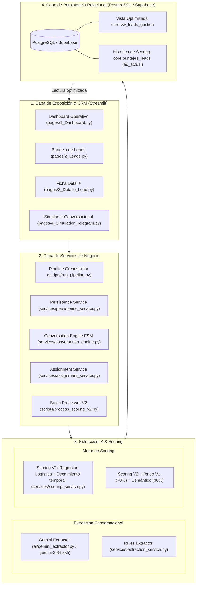
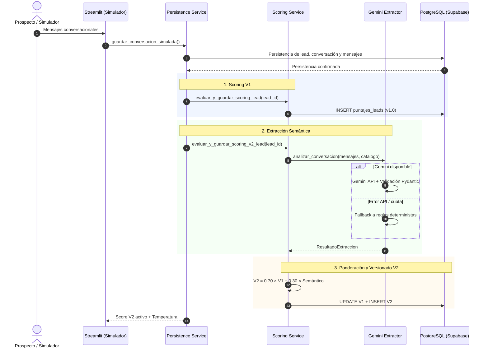
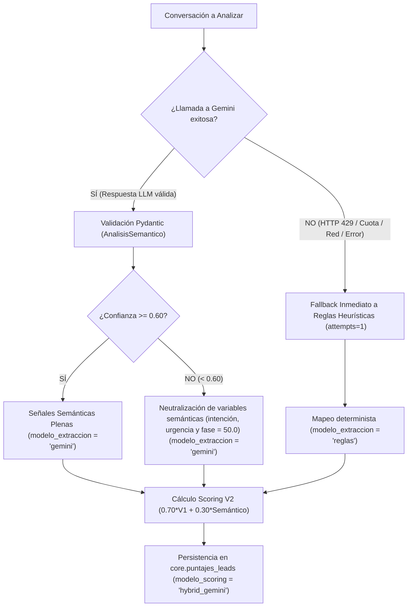
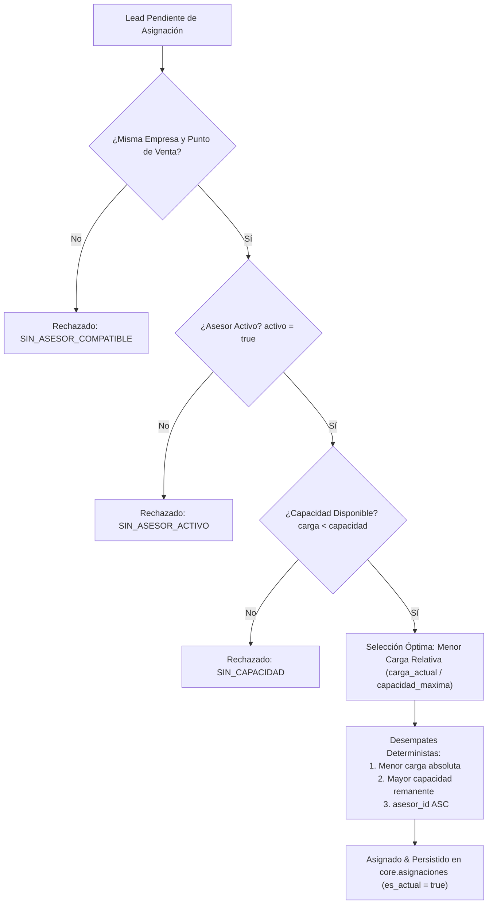

# motos-AI

> Sistema inteligente de ingesta multicanal, extracción semántica con LLM (Gemini) y fallback determinista, scoring comercial V1 basado en datos históricos y scoring híbrido V2, motor conversacional interactivo y asignación balanceada multiempresa de leads comerciales.

[](https://www.python.org/)
[](https://www.postgresql.org/)
[](https://streamlit.io/)
[](https://ai.google.dev/)
[](LICENSE)
[](tests/)

---

```markdown
## 1. Problema de Negocio

En la comercialización de motocicletas a través de canales digitales, se reciben leads provenientes de conversaciones de WhatsApp, formularios de campañas de Meta y formularios del sitio web. Estos leads son gestionados actualmente desde una bandeja común y los asesores los contactan principalmente en orden de llegada (*First-In, First-Out* / FIFO).

Este esquema presenta cuatro problemas principales:

1. **Priorización basada en orden de llegada:** los asesores atienden primero al lead que ingresó antes, sin contar con una priorización basada en señales de intención o probabilidad de compra.

2. **Demora en la atención comercial:** aproximadamente cuatro de cada diez leads no son gestionados durante las primeras 24 horas, aumentando el riesgo de pérdida de oportunidades comerciales.

3. **Información comercial no estructurada:** las conversaciones de WhatsApp contienen información relevante para la gestión —como la motocicleta de interés, disponibilidad de cuota inicial y modalidad de financiación—, pero estos datos no se incorporan de forma estructurada al CRM. Como consecuencia, el asesor debe reconstruir el contexto comercial durante la llamada.

4. **Baja conversión del proceso comercial:** según el contexto proporcionado, se reciben más de 3.000 leads mensuales y se concreta menos de una venta por cada diez leads gestionados.

### Necesidad de negocio

El problema no consiste únicamente en aumentar el volumen de leads gestionados, sino en **priorizar y contextualizar la gestión comercial**. Para ello, se requiere transformar la información disponible en los leads y sus conversaciones en señales estructuradas que permitan:

- identificar qué leads requieren atención prioritaria;
- incorporar señales de intención, urgencia y avance comercial;
- reducir la dependencia del orden de llegada como único criterio de atención;
- proporcionar al asesor información relevante antes del contacto;
- y distribuir los leads respetando las restricciones operativas de los puntos de venta y asesores.

```


---

## 2. Solución Propuesta

**motos-AI** transforma la gestión comercial mediante un pipeline desacoplado, explicable y robusto que implementa el siguiente ciclo de vida:

```text
Canales Digitales (WhatsApp / Web)
       │
       ▼
Captura & Ingesta de Leads
       │
       ▼
Normalización & Limpieza Relacional
       │
       ▼
Conversación & Extracción de Información
  ├── Extractor Semántico Gemini (google-genai / Pydantic)
  └── Fallback Determinista a Reglas (Heurístico / Resiliencia)
       │
       ▼
Motor de Scoring Comercial Híbrido
  ├── Scoring V1: Regresión Logística + Decaimiento Temporal ln(1+horas)
  └── Scoring V2: 70% Scoring V1 + 30% Puntaje Semántico
       │
       ▼
Trazabilidad & Versionado Inmutable en PostgreSQL / Supabase
  ├── V1: modelo = logistic_regression | version = v1.0 | es_actual = FALSE (Histórico)
  └── V2: modelo = hybrid_gemini       | version = v2.0 | es_actual = TRUE  (Activo)
       │
       ▼
Motor de Asignación Automática Balanceada
  ├── Aislamiento estricto por Empresa y Punto de Venta
  └── Optimización por Menor Carga Relativa (carga / capacidad)
       │
       ▼
Exposición Operativa en Streamlit CRM (Dashboard, Bandeja, Detalle de Lead y Simulador)
```

---

## 3. Arquitectura del Sistema

El sistema opera bajo una arquitectura modular de servicios desacoplados en capas:



---

## 4. Flujo de Procesamiento End-to-End de un Lead

El procesamiento de un lead se ejecuta principalmente mediante el flujo interactivo del simulador conversacional. Al finalizar una conversación y seleccionar **"Guardar conversación en PostgreSQL"** desde `pages/4_Simulador_Telegram.py`, se ejecutan de forma secuencial las etapas de persistencia, scoring, extracción semántica y versionado.

### Flujo Interactivo — Simulador Conversacional

1. **Persistencia:** `services/persistence_service.py` coordina la persistencia del lead, conversación, mensajes y entidades estructuradas.

2. **Scoring V1:** se calcula y persiste el modelo estadístico V1 (`v1.0`, `logistic_regression`).

3. **Scoring V2:** se ejecuta el scoring híbrido (`v2.0`, `hybrid_gemini`). La extracción semántica se realiza mediante Gemini cuando está disponible; ante errores de la API o límites de cuota, se utiliza el extractor determinista como fallback.

4. **Versionado:** una vez calculado V2, el registro V1 anterior pasa a `es_actual = FALSE` y el nuevo registro V2 queda como `es_actual = TRUE`.

5. **Respuesta a la interfaz:** el servicio retorna el resultado consolidado, incluyendo el score V2 activo y su temperatura, permitiendo su visualización posterior en la Bandeja de Leads y el Dashboard.



> **Decisión de Arquitectura:** Las llamadas externas a Gemini se ejecutan fuera de la transacción de base de datos que persiste el resultado V2. Esto evita mantener una transacción abierta durante la llamada de red y desacopla la latencia o los errores de la API externa del proceso de persistencia.


---

## 5. Funcionalidades Implementadas

* **Bandeja de Gestión de Leads:** Visualización priorizada con filtros por empresa, punto de venta, canal, temperatura comercial, estado operativo y asesor asignado.
* **Extracción Semántica con LLM (Gemini):** Análisis cualitativo de diálogos comerciales con extracción estructurada de intención, urgencia, etapa del embudo, señales de compra y objeciones principales.
* **Mecanismo de Fallback Determinista:** Transición automática a extractor heurístico basado en reglas ante errores de API, cuota agotada (HTTP 429) o fallos de red.
* **Scoring Híbrido (V2):** Combinación del componente estadístico V1 (70%) con el componente semántico (30%), con desglose auditable de los factores utilizados.
* **Trazabilidad y Versionado de Scoring:** Conservación de calificaciones previas como histórico (`es_actual = false`) y promoción de Scoring V2 como calificación activa (`es_actual = true`).
* **Asignación Automática Balanceada:** Algoritmo de asignación con aislamiento corporativo multiempresa y optimización por menor carga relativa. Con esto respetamos capacidad por dia y punto de venta.
* **Tablero de Control Operacional:** Visualización de métricas operativas obtenidas directamente desde PostgreSQL, incluyendo volumen de leads, tiempos de gestión, distribución de temperaturas y avance de gestión.
* **Ficha CRM Detallada:** Vista integral del cliente con especificaciones del modelo cotizado, historial de mensajes y bitácora de eventos.
* **Simulador Conversacional Guiado:** Interfaz interactiva de chat basada en una máquina de estados finitos (FSM), con extracción reactiva, gestión contextual y persistencia en PostgreSQL con Scoring V2.
* **Orquestador de Pipeline y Procesador Batch:** Ejecución automatizada del pipeline end-to-end mediante (`scripts/run_pipeline.py`) y procesamiento especializado de Scoring V2 mediante (`scripts/process_scoring_v2.py`)

---

## 6. Scoring V1: Regresión Logística y Decaimiento Temporal

El motor **Scoring V1** genera una calificación de prioridad base continua entre **0.0 y 100.0**, sustentada en un modelo estadístico y un modelo de contingencia determinista.

### Arquitectura de Decisión V1
```text
               ¿Existen variables conversacionales
                suficientes para V1?
                               │
                      ┌────────┴────────┐
                     SÍ                 NO
                      │                 │
                      ▼                 ▼
                 Regresión  V1     Rules V1 Fallback
```

#### 1. Modelo Principal: Regresión Logística (`logistic_regression` / `v1.0`)
* **Entrenamiento:** Calibrado sobre 2.200 registros históricos de (`core.historico_cierres`).
* **Desempeño:** ROC-AUC de 0.611–0.629, PR-AUC de 0.138–0.152, con un **Lift@10% de 1.56x** (la tasa estimada en el 10% superior sube de 9.75% a 15.3%–16.4%). *Métricas obtenidas sobre el esquema de validación utilizado durante el entrenamiento de V1; no deben interpretarse como desempeño garantizado en producción.*
* **Variables y Coeficientes Reales en Código:**
  * $\text{log\_horas} = \ln(1 + \text{horas\_espera})$: Coeficiente **`-0.2550`** (modela el decaimiento continuo sin rupturas discretas).
  * $\text{pidio\_cita}$: Coeficiente **`+0.3068`**
  * $\text{manifesto\_cuota\_inicial}$: Coeficiente **`+0.4263`**
  * $\text{pago\_credito}$: Coeficiente **`-0.3749`**
  * $\text{Intercepto}$: **`+0.4981`**
* **Fórmula Matemática:**
  $$z = 0.4981 - 0.2550 \cdot \ln(1 + \text{horas}) + 0.3068 \cdot \text{cita} + 0.4263 \cdot \text{cuota} - 0.3749 \cdot \text{credito}$$
  $$p = \frac{1}{1 + e^{-z}}$$
  $$\text{puntaje\_prioridad} = \min(100.0, \max(0.0, \text{round}(p \times 100, 2)))$$

#### 2. Modelo Fallback: Rules V1
Se activa automáticamente cuando no existen variables conversacionales extraídas:
$$\text{Puntaje} = \min\Big(100, \max\big(0, (\text{Puntaje Tiempo} \times 0.70) + (\text{Aporte Cita} \times 0.15) + (\text{Aporte Cuota} \times 0.15)\big)\Big)$$
* **Escala de tiempo base:** `< 1h` $\to$ 100 pts | `1–4h` $\to$ 80 pts | `4–12h` $\to$ 60 pts | `12–24h` $\to$ 50 pts | `24–48h` $\to$ 30 pts | `> 48h` $\to$ 10 pts.
* **Aporte por cita o cuota inicial:** 15 pts adicionales por cada señal presente.

### Temperaturas Comerciales
El puntaje resultante se segmenta en 4 temperaturas operativas:

| Rango de Puntaje | Temperatura |
| :--- | :--- |
| **75.0 – 100.0** | **Crítico** | 
| **50.0 – 74.99** | **Alto** | 
| **25.0 – 49.99** | **Medio** |
| **0.0 – 24.99** | **Bajo** | 

---

## 7. Scoring V2: Fusión Híbrida Semántica

> **Regla de Diseño:** Scoring V2 no reemplaza ni elimina Scoring V1. V1 permanece como componente estadístico base y versión histórica, mientras V2 combina el resultado de V1 con señales semánticas cualitativas y se convierte en la versión activa del scoring del lead.

### Fórmula de Ponderación Híbrida
Implementada en [services/scoring_service.py](services/scoring_service.py):

$$\text{puntaje\_v2} = \min\Big(100.0, \max\big(0.0, \text{round}(0.70 \times \text{puntaje\_v1} + 0.30 \times \text{puntaje\_semantico}, 2)\big)\Big)$$

### Cálculo del Componente Semántico (0–100 pts)
$$\text{puntaje\_base} = (0.50 \times \text{Puntos Intención}) + (0.30 \times \text{Puntos Urgencia}) + (0.20 \times \text{Puntos Fase Embudo})$$
$$\text{incrementos} = (+5.0 \text{ si solicita\_asesor}) + (+5.0 \text{ si solicita\_cotizacion}) + (+5.0 \text{ si solicita\_cita})$$
$$\text{puntaje\_semantico} = \min(100.0, \max(0.0, \text{puntaje\_base} + \text{incrementos}))$$

#### Tablas de Puntuación Semántica

**Intención de Compra (50%)** (Qué tan clara es la intención del cliente de comprar)

| Nivel | Valor |
| :--- | ---: |
| **Alta** (`alta`) | 100.0 pts |
| **Media** (`media`) | 60.0 pts |
| **Baja** (`baja`) | 20.0 pts |
| **Indeterminada** (`indeterminada`) | 50.0 pts |

**Urgencia Temporal (30%)** (Qué tan pronto parece querer avanzar)

| Nivel | Valor |
| :--- | ---: |
| **Alta** (`alta`) | 100.0 pts |
| **Media** (`media`) | 60.0 pts |
| **Baja** (`baja`) | 20.0 pts |
| **Indeterminada** (`indeterminada`) | 50.0 pts |

**Fase del Embudo (20%)** (En qué etapa comercial está)

| Fase | Valor |
| :--- | ---: |
| **Compra** (`compra`) | 100.0 pts |
| **Visita** (`visita`) | 90.0 pts |
| **Cotización** (`cotizacion`) | 75.0 pts |
| **Evaluación** (`evaluacion`) | 60.0 pts |
| **Interés** (`interes`) | 40.0 pts |
| **Exploración** (`exploracion`) | 20.0 pts |
| **Indeterminada** (`indeterminada`) | 50.0 pts |

Cuando la extracción semántica presenta una confianza inferior a 0.60, las variables semánticas son neutralizadas a un valor de 50.0 puntos, evitando que una extracción de baja confianza produzca una modificación significativa del scoring híbrido.
---

## 8. Integración con Google Gemini

El análisis semántico utiliza el SDK oficial `google-genai` (versión `2.23.0`) con el modelo `gemini-3.8-flash`.

### Esquema Estructurado Pydantic
La respuesta de Gemini se restringe mediante `response_format` con JSON Schema estricto y validación Pydantic en [ai/schemas.py](ai/schemas.py):

```python
class AnalisisSemantico(BaseModel):
    model_config = ConfigDict(extra="forbid")
    
    intencion_compra: Literal["baja", "media", "alta", "indeterminada"]
    urgencia: Literal["baja", "media", "alta", "indeterminada"]
    fase_embudo: Literal["exploracion", "interes", "evaluacion", "cotizacion", "visita", "compra", "indeterminada"]
    solicita_asesor: bool
    solicita_cotizacion: bool
    solicita_cita: bool
    objecion_principal: Optional[str] = None
    senales_compra: List[str] = Field(default_factory=list)
    confianza: float = Field(..., ge=0.0, le=1.0)
```

---

## 9. Mecanismo de Fallback y Resiliencia

El sistema garantiza resiliencia operativa diferenciando claramente dos escenarios:



### Distinción Fundamental:
1. **Fallo de Gemini (HTTP 429, Cuota, Timeout, Red):** Se activa el extractor heurístico por reglas (`modelo_extraccion = 'reglas'`). El cálculo V2 continúa sin interrupción.
2. **Gemini Exitoso con Baja Confianza ($< 0.60$):** La llamada fue exitosa (`modelo_extraccion = 'gemini'`), pero el componente semántico se fija neutralmente en `50.0 pts` para evitar que inferencias dudosas distorsionen el score comercial.

### Distinción entre `modelo_scoring` y `modelo_extraccion`:
* **`modelo_scoring = 'hybrid_gemini'`**: Identifica el algoritmo de calificación V2 (70% V1 + 30% Semántico).
* **`modelo_extraccion = 'gemini'` vs `'reglas'`**: Identifica el origen técnico de las señales semánticas. Por ejemplo, un registro con fallback tiene `modelo_scoring = 'hybrid_gemini'` y `modelo_extraccion = 'reglas'`.

---

## 10. Versionado y Trazabilidad del Scoring

Para garantizar trazabilidad comercial y auditoría de decisiones, el sistema implementa versionado inmutable en `core.puntajes_leads`:

```sql
-- Transacción atómica de persistencia V2 (queries/scoring_queries.py)
BEGIN;
  -- 1. Desmarca score actual previo (ej. V1) para que pase a histórico
  UPDATE core.puntajes_leads
  SET es_actual = FALSE
  WHERE lead_id = %(lead_id)s AND es_actual = TRUE;

  -- 2. Garantiza idempotencia eliminando V2 previo si ya existía para este lead
  DELETE FROM core.puntajes_leads
  WHERE lead_id = %(lead_id)s AND version_scoring = 'v2.0';

  -- 3. Inserta el nuevo score V2 como vigente
  INSERT INTO core.puntajes_leads (
      lead_id, puntaje_prioridad, temperatura, modelo_scoring, version_scoring, razones, puntuado_en, es_actual
  ) VALUES (
      %(lead_id)s, %(puntaje_prioridad)s, %(temperatura)s, 'hybrid_gemini', 'v2.0', %(razones)s, NOW(), TRUE
  );
COMMIT;
```

* **V1 — Versión histórica:** `modelo_scoring = 'logistic_regression'`, `version_scoring = 'v1.0'`, `es_actual = FALSE`.
* **V2 Activo:** `modelo_scoring = 'hybrid_gemini'`, `version_scoring = 'v2.0'`, `es_actual = TRUE`.
* **Consumo Transparente:** La vista `core.vw_leads_gestion`, el Dashboard y la Bandeja consumen el registro donde `es_actual = TRUE`.

### Formato de Explicabilidad JSONB en V2:
```json
{
  "modelo": "hybrid_gemini",
  "version": "v2.0",
  "puntaje_v1": 70.19,
  "puntaje_semantico": 100.0,
  "puntaje_v2": 79.13,
  "temperatura_v2": "Alto",
  "modelo_extraccion": "gemini",
  "version_extraccion": "1.0",
  "razones_v1": "{\"probabilidad\": 0.7019, \"contacto_rapido\": true, \"solicita_cita\": true}",
  "razones_semanticas": [
    "Intención de compra: alta (100.0 pts -> 50.0 base)",
    "Urgencia: alta (100.0 pts -> 30.0 base)",
    "Fase del embudo: compra (100.0 pts -> 20.0 base)",
    "Solicita cotización formal (+5 pts)",
    "Solicita cita / visita (+5 pts)",
    "Señal detectada: Tiene 3 millones para la inicial",
    "Señal detectada: Quiere comprar la moto"
  ]
}
```

---

## 11. Simulador Conversacional Guiado

La aplicación incluye un simulador de diálogo ([pages/4_Simulador_Telegram.py](pages/4_Simulador_Telegram.py)) respaldado por una máquina de estados finitos (FSM) de 6 capas en [services/conversation_engine.py](services/conversation_engine.py).

### Capacidades del Simulador:
* **Slot-Filling Proactivo:** Guiado contextual paso a paso para capturar:
  1. Modelo / SKU de interés (contrastado contra el catálogo oficial).
  2. Método de pago (Contado vs. Crédito).
  3. Cuota inicial declarada (monto numérico).
  4. Solicitud de cotización formal.
  5. Solicitud de cita / visita presencial.
  6. Sede / Ciudad de atención.
* **Extracción NLP en Tiempo Real:** Panel lateral con sincronización reactiva de entidades detectadas y preservación estricta de `NULL`.
* **Persistencia Integral con Scoring V2:** El botón *"Guardar conversación en PostgreSQL"* ejecuta [services/persistence_service.py](services/persistence_service.py), generando tanto el registro histórico V1 como el registro activo V2, devolviendo el **Score V2** inmediatamente al usuario en la interfaz.

---

## 12. Motor de Asignación Automática de Asesores

El motor de asignación comercial ([services/assignment_service.py](services/assignment_service.py)) opera bajo reglas de determinismo y aislamiento:



### Reglas de Asignación:
1. **Aislamiento Multiempresa Estricto:** Un lead solo puede asignarse a un asesor que pertenezca a su misma `empresa_id` y `punto_venta_id`.
2. **Priorización de Despacho:** Los leads se asignan en orden descendente:
   $$\text{puntaje\_prioridad DESC} \longrightarrow \text{puntaje\_urgencia DESC} \longrightarrow \text{registrado\_en ASC}$$
3. **Criterio de Balanceo:** Se selecciona el asesor con menor **carga relativa** ($\frac{\text{carga diaria}}{\text{capacidad diaria}}$).
4. **Idempotencia Transaccional:** La tabla `core.asignaciones` cuenta con un índice único parcial:
   ```sql
   CREATE UNIQUE INDEX uq_asignaciones_lead_actual 
   ON core.asignaciones (lead_id) WHERE es_actual = true;
   ```

---

## 13. Modelo de Datos Relacional (PostgreSQL / Supabase)

El esquema `core` en PostgreSQL está normalizado y preparado para concurrencia:


### Tablas Principales:
* **`core.empresas`:** Empresas comerciales (`EMP-01`, etc.).
* **`core.puntos_venta`:** Concesionarios y salas de venta vinculadas.
* **`core.asesores`:** Asesores comerciales, sede, estado activo y capacidad diaria máxima.
* **`core.motocicletas`:** Catálogo oficial (SKU, marca, línea, cilindraje, precio lista).
* **`core.motocicletas_puntos_venta`:** Disponibilidad e inventario por sede.
* **`core.leads`:** Entidad central del prospecto comercial.
* **`core.fuentes_leads`:** Trazabilidad de origen y archivo de procedencia.
* **`core.conversaciones` & `core.mensajes`:** Trazabilidad conversacional con orden y roles (`Cliente`, `Asesor`, `Bot`).
* **`core.extracciones_ia`:** Registro de variables estructuradas y metadata de extracción.
* **`core.puntajes_leads`:** Historial de calificaciones (V1 y V2) con bandera `es_actual` y razones JSONB.
* **`core.asignaciones`:** Asignaciones vigentes e históricas entre prospectos y asesores.
* **`core.eventos_gestion`:** Bitácora de seguimiento y cambios de estado comercial.
* **`core.historico_cierres`:** Dataset supervisado de 2.200 casos cerrado para modelado.
* **`core.vw_leads_gestion`:** Vista SQL de lectura optimizada para Streamlit.

---

## 14. Aplicación Web Streamlit CRM

La interfaz web está organizada en 4 páginas especializadas:

| Página | Archivo | Funcionalidad y Contenido |
| :--- | :--- | :--- |
| **Inicio / Resumen** | [app.py](app.py) | KPIs operacionales en tiempo real, distribución por temperatura y accesos rápidos. |
| **Dashboard Operativo** | [pages/1_Dashboard.py](pages/1_Dashboard.py) | Tablero analítico con selector de empresa, gráficos de volumen por sede, embudo de gestión e histograma de puntajes. |
| **Bandeja de Leads** | [pages/2_Leads.py](pages/2_Leads.py) | Lista de trabajo priorizada con filtros por empresa, sede, canal, temperatura comercial y estado de asignación. |
| **Ficha Detalle 360°** | [pages/3_Detalle_Lead.py](pages/3_Detalle_Lead.py) | Vista integral del prospecto, ficha técnica de la moto cotizada, razones del scoring V2 y cronología del chat. |
| **Simulador Conversacional** | [pages/4_Simulador_Telegram.py](pages/4_Simulador_Telegram.py) | Consola interactiva de chat con motor FSM, extracción NLP reactiva y botón de persistencia en vivo con Scoring V2. |

---

## 15. Pruebas Automatizadas

La suite de pruebas en `tests/` valida exhaustivamente todas las capas del sistema con un total de **75 pruebas unitarias e integradas (100% aprobadas)**:

```text
75 passed in 6.94s
```

### Desglose por Familia de Pruebas:
* **[tests/test_scoring.py](tests/test_scoring.py)** (15 tests): Cálculo de decaimiento temporal, Regresión Logística V1, consistencia de temperaturas, límites numéricos (0–100) y explicabilidad.
* **[tests/test_scoring_v2.py](tests/test_scoring_v2.py)** (9 tests): Ponderación 70/30, impacto de intención y urgencia, neutralización por baja confianza (<0.60), bounds y razones semánticas.
* **[tests/test_scoring_v2_persistence.py](tests/test_scoring_v2_persistence.py)** (6 tests): Persistencia transaccional V2, conservación histórica de V1 (`es_actual=false`), idempotencia en base de datos y rollback ante fallos.
* **[tests/test_gemini_extractor.py](tests/test_gemini_extractor.py)** (9 tests): Validación de esquemas Pydantic, extracción con Gemini, captura de errores, fallback ante HTTP 429 y sin API key.
* **[tests/test_process_scoring_v2.py](tests/test_process_scoring_v2.py)** (7 tests): Procesamiento batch de leads pendientes, simulación `--dry-run`, precedencia de `--delay` y aislamiento de errores.
* **[tests/test_conversation_engine.py](tests/test_conversation_engine.py)** (19 tests): Flujo conversacional guiado FSM de 6 capas, resolución de variables y sincronización de vistas de extracción.
* **[tests/test_simulator_scoring_v2.py](tests/test_simulator_scoring_v2.py)** (6 tests): Integración end-to-end del simulador con Scoring V2:
  1. *Conversación normal:* lead nuevo $\to$ V1 $\to$ V2 $\to$ V2 actual.
  2. *Gemini disponible:* `modelo_extraccion='gemini'`, `modelo_scoring='hybrid_gemini'`, `v2.0`.
  3. *Gemini falla / 429:* fallback a reglas, `modelo_scoring='hybrid_gemini'`, `v2.0`, `es_actual=true`.
  4. *V1 histórico:* `V1.es_actual=false`, `V2.es_actual=true` (ambos existen en base de datos).
  5. *No duplicación:* exactamente una sola fila activa (`es_actual=true`) por lead.
  6. *Rollback / Resiliencia:* manejo seguro ante fallos sin corromper transacciones.
* **[tests/test_assignment.py](tests/test_assignment.py)** (10 tests): Aislamiento multiempresa, desempates deterministas, control de capacidad y no duplicación.

---

## 16. Validaciones Reales en Base de Datos

El comportamiento de versionado inmutable y fallback se encuentra validado en PostgreSQL:

### Caso 1: `LEAD-021` (Prueba Controlada de Ingesta y Resiliencia)
* **Conversación:** *“Estoy interesado en la Apache RTR 160. Tengo 3 millones para la inicial y quiero comprarla. ¿Puedo ir hoy?”* (Crédito, cotización sí, cita sí, Pereira).
* **Extracción persistida en `core.extracciones_ia`:** `sku = MOT-022`, `pago_inicial = 3.000.000`, `metodo_pago = Crédito`, `solicita_cita = true`, `solicita_cotizacion = true`.
* **Registro V1 (`core.puntajes_leads`):** `version_scoring = 'v1.0'`, `modelo_scoring = 'logistic_regression'`, `puntaje_prioridad = 70.19`, `es_actual = FALSE` (Histórico).
* **Registro V2 (`core.puntajes_leads`):** `version_scoring = 'v2.0'`, `modelo_scoring = 'hybrid_gemini'`, `puntaje_prioridad = 64.13`, `temperatura = Alto`, `es_actual = TRUE` (Activo).
* **Trazabilidad del Extractor:** `modelo_extraccion = 'reglas'`. En este caso, la extracción semántica operó mediante el **fallback determinista a reglas** debido al límite de cuota/frecuencia de Gemini Free Tier, demostrando la resiliencia operativa del sistema.

### Caso 2: `LEAD-056` (Verificación de Flujo Desplegado)
* **Registro V1:** `version_scoring = 'v1.0'`, `modelo_scoring = 'logistic_regression'`, `puntaje_prioridad = 69.10`, `temperatura = Alto`, `es_actual = FALSE` (Histórico).
* **Registro V2:** `version_scoring = 'v2.0'`, `modelo_scoring = 'hybrid_gemini'`, `puntaje_prioridad = 63.37`, `temperatura = Alto`, `es_actual = TRUE` (Activo).

---

## 17. Limitaciones Conocidas

1. **Disponibilidad y Cuotas de LLM:** La extracción semántica con Gemini depende de la disponibilidad y los límites de cuota por minuto (*RPM*) del proveedor (en planes Free Tier). El sistema incluye un fallback automático a reglas que mantiene 100% operativo el pipeline de scoring y persistencia aun cuando la API externa no responda.
2. **Neutralización por Baja Confianza:** Cuando el análisis semántico arroja una confianza menor a `0.60`, las variables semánticas se neutralizan a `50.0 pts` para priorizar la estabilidad estadística de V1 sobre inferencias inciertas.
3. **Webhooks en Producción:** La interacción conversacional opera actualmente mediante la interfaz del Simulador en Streamlit y procesos de carga por lotes; no cuenta aún con webhooks directos desplegados hacia las APIs Cloud oficiales de Meta o Telegram.

---

## 18. Variables de Entorno

El archivo `.env` requiere las siguientes variables de configuración (basado en [.env.example](.env.example)):

```env
# Conexión a PostgreSQL / Supabase Pooler
DB_HOST=aws-0-us-east-1.pooler.supabase.com
DB_PORT=5432
DB_NAME=postgres
DB_USER=postgres.TU_PROJECT_REF
DB_PASSWORD=TU_PASSWORD

# API Key de Google Gemini (google-genai)
GEMINI_API_KEY=TU_API_KEY_DE_GEMINI

---

## 19. Instalación y Ejecución Local

### Prerrequisitos
* Python 3.10 o superior instalado.
* Conexión a una base de datos PostgreSQL 15+ (local o Supabase).
* Git instalado.

### Paso a Paso

1. **Clonar el repositorio:**
   ```bash
   git clone https://github.com/c-c23/motos-AI.git
   cd motos-AI
   ```

2. **Crear y activar un entorno virtual:**
   * En Windows (PowerShell):
     ```powershell
     python -m venv venv
     .\venv\Scripts\Activate.ps1
     ```
   * En Linux / macOS:
     ```bash
     python3 -m venv venv
     source venv/bin/activate
     ```

3. **Instalar dependencias del proyecto:**
   ```bash
   pip install --upgrade pip
   pip install -r requirements.txt
   ```

4. **Configurar variables de entorno:**
   ```bash
   cp .env.example .env
   # Edita .env con tus credenciales de PostgreSQL y tu GEMINI_API_KEY
   ```

5. **Iniciar la aplicación Streamlit CRM:**
   ```bash
   streamlit run app.py
   ```
   La interfaz se abrirá en `http://localhost:8501`.

6. **Ejecutar la suite de pruebas:**
   ```powershell
   pytest tests/ -v
   ```

7. **Procesar Scoring V2 masivo de leads pendientes (Opcional):**
   ```bash
   # Simulación sin escrituras
   python scripts/process_scoring_v2.py --dry-run

   # Procesar un lote controlado con rate limiting
   python scripts/process_scoring_v2.py --limit 20 --delay 2.0
   ```

---

## 20. Aplicación Pública Desplegada

La plataforma se encuentra desplegada y disponible públicamente en Streamlit Cloud:

* **URL de Producción:** [https://motos-ai-fp4dwrtb52ktwd9xpmh7v.streamlit.app/](https://motos-ai-fp4dwrtb52ktwd9xpmh7v.streamlit.app/)

---

## 21. Estructura del Directorio

```text
motos-AI/
├── .streamlit/
│   └── config.toml               # Configuración del tema visual de Streamlit
├── ai/
│   ├── __init__.py               # Paquete del módulo de Inteligencia Artificial
│   ├── gemini_extractor.py       # Extractor semántico Gemini + fallback automático
│   └── schemas.py                # Esquemas Pydantic estrictos (AnalisisSemantico, ResultadoExtraccion)
├── database/
│   └── migrations/               # Scripts de migración SQL versionados (001 a 004)
│       ├── 001_create_schemas.sql
│       ├── 002_scoring_v1_schema.sql
│       ├── 003_historico_cierres_schema.sql
│       └── 004_assignment_persistence.sql
├── models/
│   └── logistic_regression_v1.joblib  # Modelo serializado de Regresión Logística V1
├── pages/
│   ├── 1_Dashboard.py            # Tablero analítico y KPIs operacionales
│   ├── 2_Leads.py                # Bandeja de entrada y cola de trabajo priorizada
│   ├── 3_Detalle_Lead.py         # Ficha 360° del lead y auditoría de scoring
│   └── 4_Simulador_Telegram.py   # Simulador conversacional interactivo con scoring V2 en vivo
├── queries/
│   ├── dashboard_queries.py      # Agregaciones SQL analíticas
│   ├── leads_queries.py          # Consultas para la bandeja y ficha de detalle
│   ├── persistence_queries.py    # Inserciones transaccionales atómicas
│   └── scoring_queries.py        # Lectura y persistencia de puntajes V1/V2 y razones
├── scripts/
│   ├── assign_leads.py           # Script de asignación masiva de leads
│   ├── load_conversations.py     # Carga de conversaciones y mensajes
│   ├── load_dimensions.py        # Carga de empresas, puntos de venta y asesores
│   ├── load_historico_cierres.py # Carga del dataset histórico de entrenamiento
│   ├── load_leads.py             # Carga inicial de leads operacionales
│   ├── process_scoring_v2.py     # Procesador batch transaccional de Scoring V2 con rate limiting
│   ├── run_pipeline.ps1          # Wrapper PowerShell para Task Scheduler
│   ├── run_pipeline.py           # Orquestador integral end-to-end del pipeline
│   ├── score_real_leads.py       # Cálculo masivo de scoring V1
│   └── train_logistic_regression.py # Entrenamiento y serialización de Regresión Logística
├── services/
│   ├── assignment_service.py     # Lógica y reglas de asignación comercial balanceada
│   ├── conversation_engine.py    # Motor conversacional FSM de 6 capas
│   ├── extraction_service.py     # Extractor NLP tradicional por reglas
│   ├── persistence_service.py    # Coordinador transaccional de persistencia (ingesta + V1 + V2)
│   └── scoring_service.py        # Motor híbrido de scoring (V1 LR/Rules + V2 Semántico)
├── styles/
│   └── theme.py                  # Tokens de diseño visual, CSS y badges
├── tests/
│   ├── test_assignment.py        # Pruebas del motor de asignación (10 escenarios)
│   ├── test_conversation_engine.py # Pruebas del motor conversacional guiado
│   ├── test_dashboard_queries.py # Pruebas de consultas agregadas del dashboard
│   ├── test_extraction_pilot.py  # Pruebas de extracción y preservación de NULLs
│   ├── test_gemini_extractor.py  # Pruebas del extractor Gemini y fallback a reglas
│   ├── test_pipeline.py          # Pruebas de integración del pipeline end-to-end
│   ├── test_process_scoring_v2.py # Pruebas del procesador batch de Scoring V2
│   ├── test_scoring.py           # Pruebas del scoring V1 y explicabilidad
│   ├── test_scoring_v2.py        # Pruebas del cálculo híbrido Scoring V2
│   ├── test_scoring_v2_persistence.py # Pruebas de persistencia e idempotencia V2
│   └── test_simulator_scoring_v2.py # Pruebas de integración del simulador con Scoring V2
├── .env.example                  # Plantilla de variables de entorno
├── .gitignore                    # Reglas de exclusión de Git
├── app.py                        # Punto de entrada de la aplicación Streamlit
├── database.py                   # Módulo central de conexión a PostgreSQL
└── requirements.txt              # Dependencias de Python del proyecto
```

---

## 22. Estado del Proyecto

* **Fase:** Assessment Técnico — Prototipo Funcional Completo con Scoring Híbrido V2 e IA Generativa.
* **Cobertura:** Ingesta multicanal, Extracción NLP + Gemini, Scoring V1 y V2 Híbrido, Persistencia Transaccional, Simulador FSM, Asignación Multiempresa y Dashboard Streamlit **100% implementados, verificados y testeados con 75 pruebas aprobadas**.
* **Repositorio:** [https://github.com/c-c23/motos-AI](https://github.com/c-c23/motos-AI)


